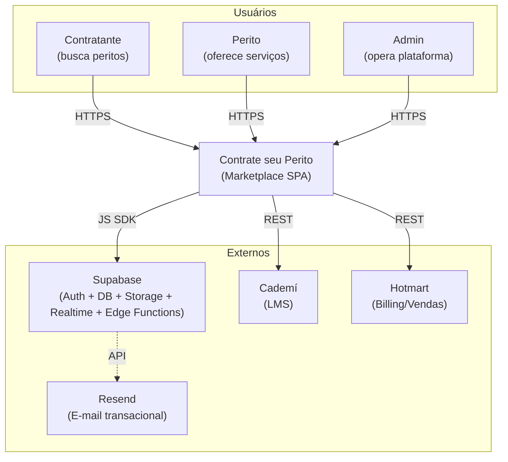
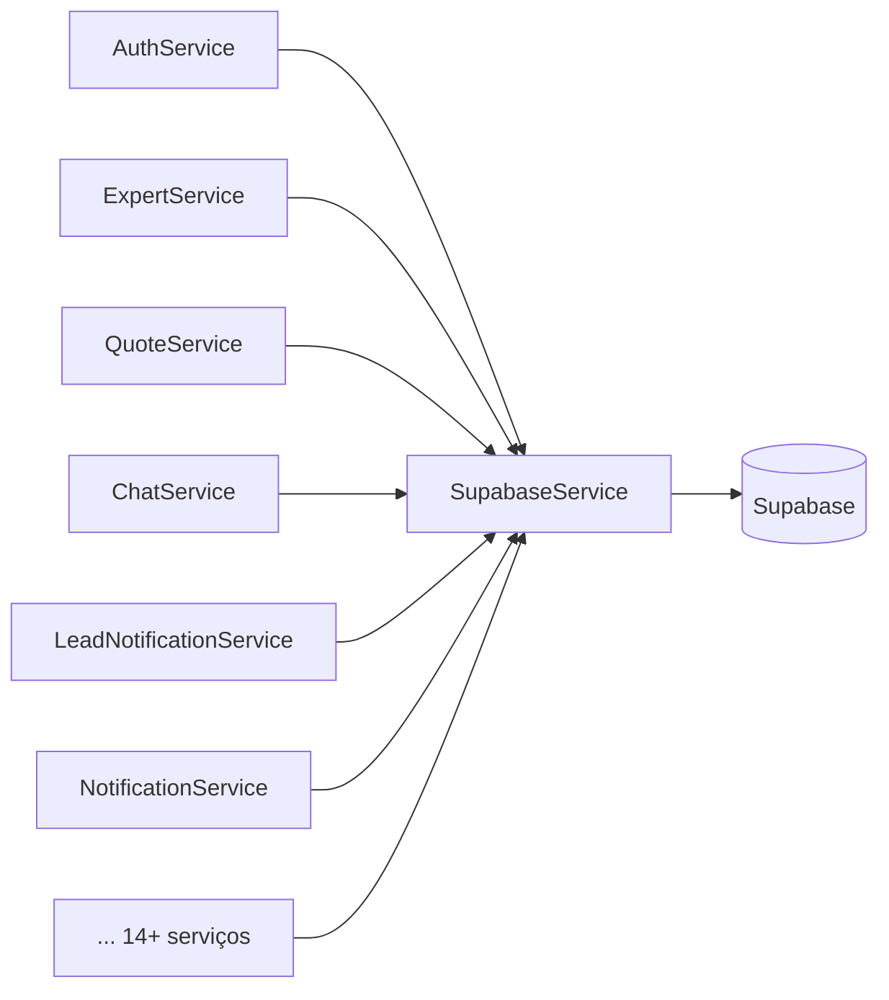

# C4 — Contexto e Containers

Diagramas no estilo [C4 Model](https://c4model.com).

## Nível 1 — Contexto



**Atores externos:**

- **Contratante** — descobre, contata e contrata peritos.
- **Perito** — mantém perfil, responde leads/orçamentos.
- **Admin** — modera, aprova, audita.

**Sistemas externos:**

- **Supabase** — backend completo (banco, auth, storage, realtime).
- **Cademí** — cursos e conteúdo educacional para peritos.
- **Hotmart** — vendas e billing.
- **Resend** — provedor de e-mail transacional (chamado pelas Edge Functions a partir do domínio `axelpro.com.br`). Veja [api/edge-functions.md](../api/edge-functions.md) e [devops/resend-setup.md](../devops/resend-setup.md).

---

## Nível 2 — Containers

```mermaid
graph TB
    Browser["Browser (SPA)"]

    subgraph "Angular SPA"
        Pages["Páginas (lazy routes)"]
        Components["Componentes (Material)"]
        Services["Serviços de domínio"]
        SupaSvc["SupabaseService<br/>(wrapper único)"]
        Guards["Guards<br/>(auth/expert/admin)"]
    end

    subgraph "Supabase Cloud"
        Auth["Auth<br/>(JWT)"]
        PG["PostgreSQL<br/>(+ RLS)"]
        Storage["Storage<br/>(avatars, CV)"]
        RT["Realtime<br/>(Postgres CDC)"]
        Trig["Triggers/Functions<br/>(handle_new_user,<br/>update_expert_rating,<br/>create_service_completion)"]
        Edge["Edge Functions (Deno)<br/>create-user, delete-user, list-users,<br/>check-email-exists,<br/>send-email, send-broadcast,<br/>send-password-reset"]
    end
    Resend["Resend API"]

    Browser --> Pages
    Pages --> Components
    Pages --> Guards
    Components --> Services
    Services --> SupaSvc
    SupaSvc -->|signIn/signUp| Auth
    SupaSvc -->|from().select/insert| PG
    SupaSvc -->|storage.from()| Storage
    SupaSvc -->|channel()| RT
    SupaSvc -->|functions.invoke()| Edge
    Edge -->|service_role| PG
    Edge -->|service_role| Auth
    Edge -->|HTTPS| Resend
    PG --> Trig
```

**Pontos-chave:**

- O Angular **nunca** chama PostgREST direto — sempre via [SupabaseService](../../src/app/services/supabase.service.ts).
- Guards são **UX**; autorização real está nas policies RLS do Postgres.
- Realtime usa o canal de mudanças do Postgres para sincronizar `messages` no chat.
- Triggers/funções (`handle_new_user`, `update_expert_rating`, `create_service_completion`) executam regras críticas dentro do banco — não dependem da SPA.
- **Edge Functions** são o único lugar onde a `service_role` é usada. Servem para: operações administrativas (criar/listar/deletar usuários), envio de e-mail via Resend, e validações server-side (`check-email-exists`).

---

## Nível 3 — Componentes (resumido)

Cada serviço em `src/app/services/` é um "componente" no jargão C4. Veja [overview.md](overview.md#25-serviços-de-domínio--srcappservices) para a tabela completa.



Um único ponto de contato com o backend = um único lugar para instrumentar, retry, logging e troca futura de provedor.
