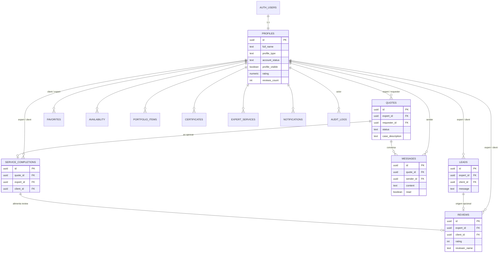
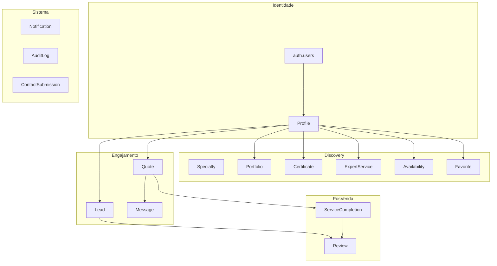

# ERD — Diagrama Entidade-Relacionamento

## Cardinalidades importantes

- **profiles ↔ auth.users:** 1:1 estrita.
- **profiles → quotes:** um perito recebe muitas; um requester (autenticado) cria muitas.
- **quotes → messages:** 1:N com `ON DELETE CASCADE` em messages.
- **quotes → service_completions:** 1:1 (criado pelo trigger).
- **service_completions → reviews:** 1:0..1 (cliente pode não avaliar).
- **favorites:** N:N entre `clients` e `experts` (com unicidade por par).

## Diagrama de domínios (alto nível)

