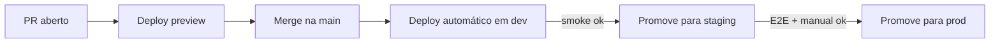

# Deploy

## Modelo

SPA estática + Supabase gerenciado. Deploy = subir `dist/contrate-seu-perito/browser/` para um host estático com CDN.

## Opções de hospedagem

| Plataforma          | Prós                                 | Contras                              |
| ------------------- | ------------------------------------ | ------------------------------------ |
| Vercel              | DX excelente, previews por PR        | Cobrança por bandwidth               |
| Netlify             | Idem Vercel                          | Idem                                 |
| Cloudflare Pages    | CDN global gratuita, sem cold start  | DX menos polida                      |
| AWS S3 + CloudFront | Total controle, baratíssimo em escala| Mais setup                           |
| Supabase Hosting    | Stack tudo em um                     | Limitações em comparação aos demais  |

Escolha alvo: **Cloudflare Pages** (custo + edge global). Registrar em ADR quando decidir.

## Estratégia de deploy



## SPA — configuração de rewrite

Toda rota desconhecida deve cair em `/index.html` (Angular cuida do resto):

- Cloudflare Pages: `_redirects`:
  ```
  /*  /index.html  200
  ```
- Netlify: idem.
- S3 + CloudFront: error pages 403/404 → `/index.html` com 200.

## Cabeçalhos HTTP

```
Cache-Control: public, max-age=31536000, immutable   # assets com hash
Cache-Control: public, max-age=0, must-revalidate    # index.html
X-Content-Type-Options: nosniff
X-Frame-Options: DENY
Referrer-Policy: strict-origin-when-cross-origin
Permissions-Policy: camera=(), microphone=(), geolocation=()
Content-Security-Policy: <ver security/csp.md (proposta)>
Strict-Transport-Security: max-age=63072000; includeSubDomains; preload
```

## Promoção entre ambientes

- **dev → staging:** merge em `release/*` ou tag.
- **staging → prod:** tag `vX.Y.Z` aciona pipeline de produção.

Cada promoção:

1. CI roda build com config do alvo.
2. Aplica migrations pendentes ([database/migrations.md](../database/migrations.md)).
3. Sobe assets.
4. Invalida cache da CDN (`index.html`).
5. Roda smoke E2E.

## Rollback

### Frontend

- **Atomic deploys (preferido):** plataformas como Vercel/Netlify/CF Pages mantêm deploys anteriores. Rollback = 1 clique / 1 comando.
- **S3:** versionamento de bucket + script para reverter pasta.

### Banco

- **Down migration** específica.
- Em pior cenário: **restore de snapshot** ([backup-restore.md](backup-restore.md)).
- Comunicação **antes** de iniciar restore (afeta dados gravados após o backup).

## Janela de deploy

- Evitar segunda de manhã (após fim de semana com bugs acumulados? Não — preferir terça/quarta).
- Sem deploy de prod sexta após 16h.
- Sem deploy durante incidente em curso.

## Comunicação

- Canal `#deploys` (Slack/equivalente) recebe notificação automática.
- Antes de prod: avisar `#engineering` 10 min antes.
- Pós-deploy: monitorar logs/alertas por 30 min.
