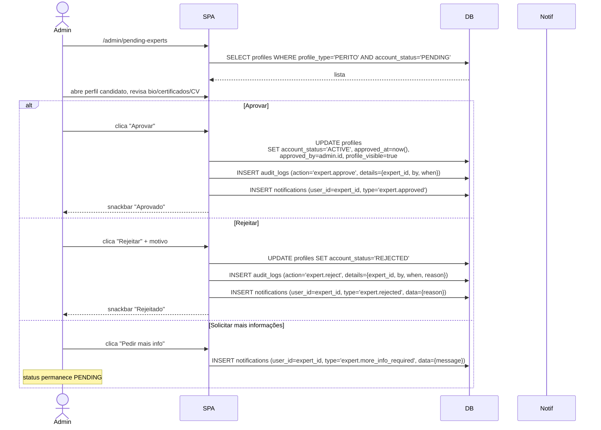

# Fluxo: Aprovação Administrativa de Perito



## Critérios de aprovação (sugestão de checklist)

1. Identidade: nome completo coerente com documentos.
2. Especialidade do catálogo (não livre).
3. Pelo menos 1 certificação válida com `issuing_organization` reconhecida.
4. Bio com escopo claro.
5. `cv_url` presente.
6. Foto de perfil profissional (avatar).

## Auditoria

Cada decisão grava `audit_logs` com `action ∈ {expert.approve, expert.reject, expert.more_info_required}` e `details` JSON com:

```json
{
  "expert_id": "uuid",
  "by": "admin_uuid",
  "when": "iso8601",
  "previous_status": "PENDING",
  "new_status": "ACTIVE | REJECTED",
  "reason": "string (opcional)"
}
```

## Regras envolvidas

- [RN-011, RN-012, RN-130, RN-131, RN-140](../business-rules/regras-de-negocio.md).
