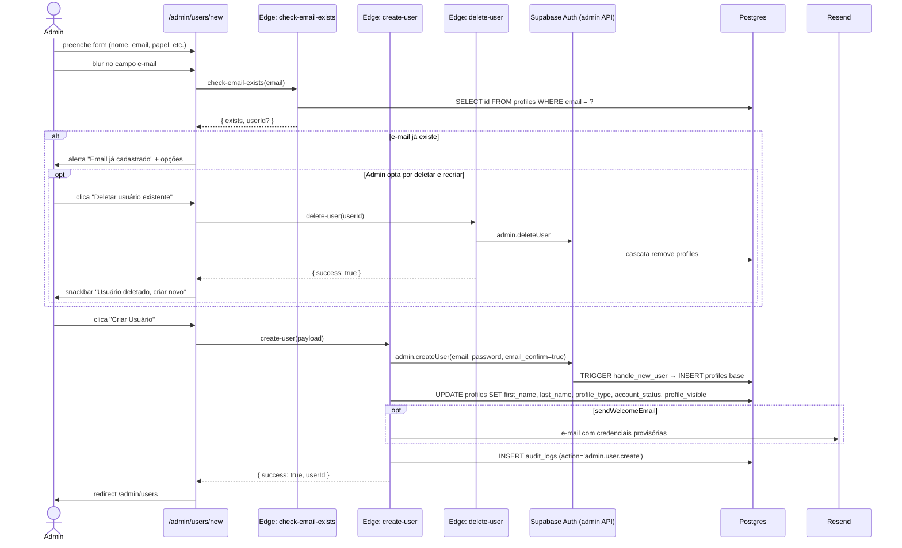

# Fluxo: Admin cria usuário

Painel administrativo permite criar contas de qualquer papel (`CONTRATANTE`, `PERITO`, `ADMIN`) sem passar pelo onboarding normal.

## Pontos críticos

| Item                                                          | Onde                                                        |
| ------------------------------------------------------------- | ----------------------------------------------------------- |
| Verificação preventiva de duplicidade                         | `check-email-exists` (Edge Function)                        |
| Criação ignora o fluxo público — define `account_status` ativo| Por isso é restrita a admin (JWT validado na função)        |
| Cascata de exclusão respeita FKs                              | RN-015                                                      |
| Toda criação é auditada                                       | RN-140 — `audit_logs` com action `admin.user.create`        |
| Senha temporária deve ser trocada no primeiro login           | (opcional) — campo `must_change_password` em `profiles`      |

## Casos de erro

| Sintoma                                | Causa provável                                   | Tratamento                                                              |
| -------------------------------------- | ------------------------------------------------ | ----------------------------------------------------------------------- |
| `check-email-exists` retorna `exists`  | E-mail duplicado                                 | UI sugere editar usuário ou deletar+recriar                             |
| `create-user` retorna 5xx              | Variável de ambiente ausente / `service_role`    | Ver [runbooks/RB-090-edge-function-create-user.md](../runbooks/RB-090-edge-function-create-user.md) |
| `delete-user` falha                    | FK que não tem CASCADE                            | Investigar; pode requerer migration                                     |
| Welcome email não chega                | Domínio Resend não verificado / spam             | [devops/resend-setup.md](../devops/resend-setup.md)                     |

## Regras envolvidas

- [RN-014](../business-rules/regras-de-negocio.md) — e-mail de contato único.
- [RN-130, RN-131, RN-132, RN-140](../business-rules/regras-de-negocio.md#15-administração) — administração e auditoria.
- [RN-018](../business-rules/regras-de-negocio.md) — admin pode deletar conta antes de recriar com mesmo e-mail.

## Componentes envolvidos

- [admin-user-create.ts](../../src/app/pages/admin-dashboard/admin-user-create.ts)
- [SupabaseService](../../src/app/services/supabase.service.ts) — métodos `checkEmailExists`, `deleteUser`, `listAuthUsers`.
- Edge Functions: `check-email-exists`, `create-user`, `delete-user` — ver [api/edge-functions.md](../api/edge-functions.md).
