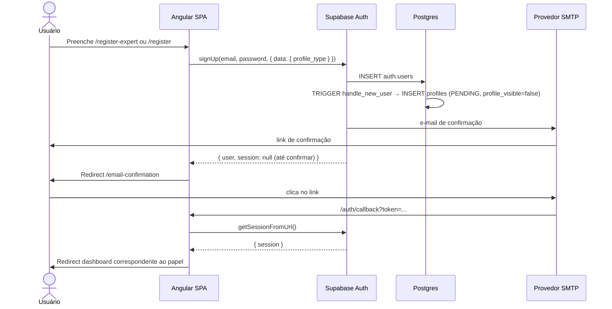
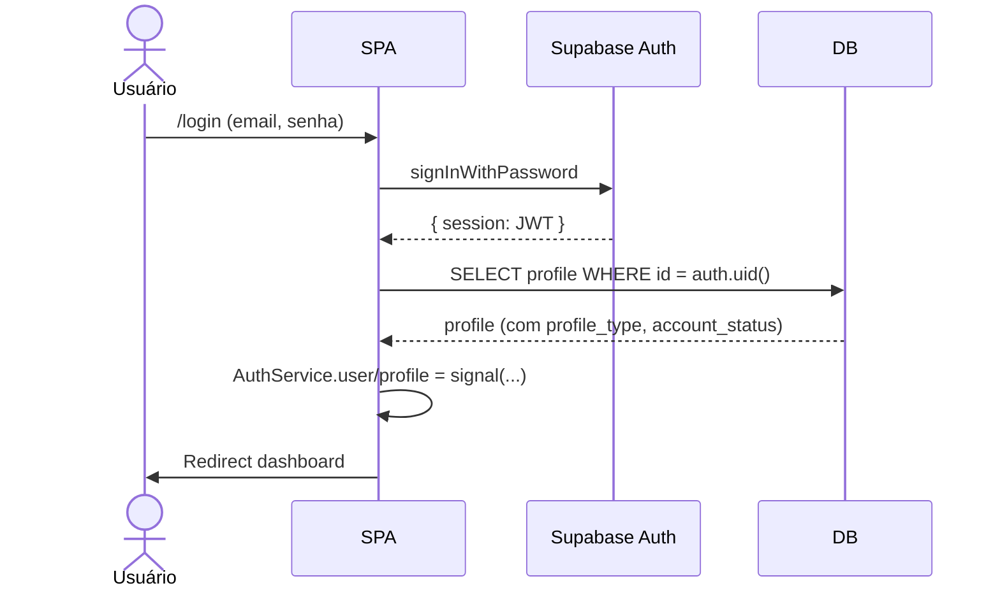
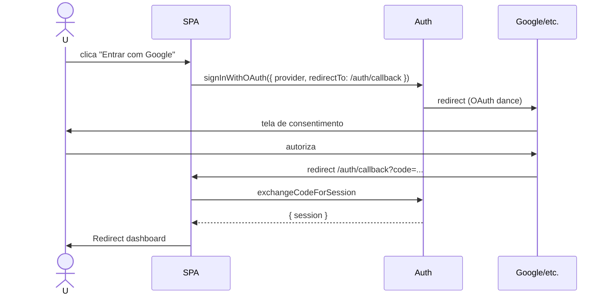
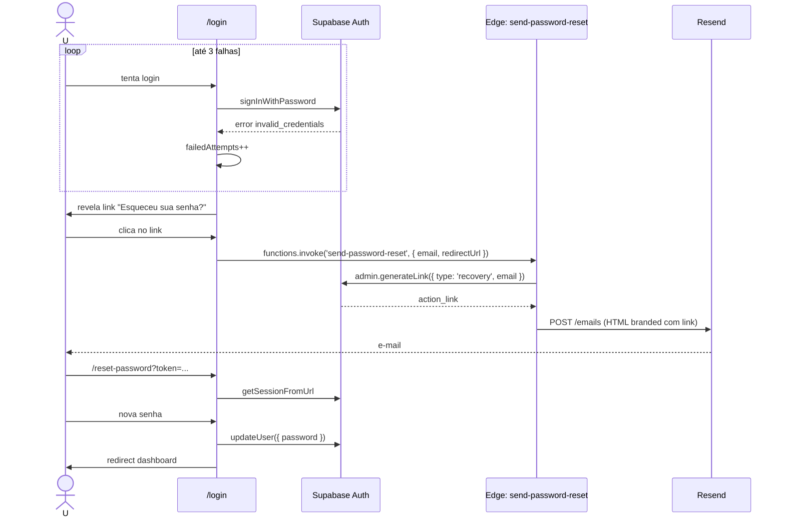
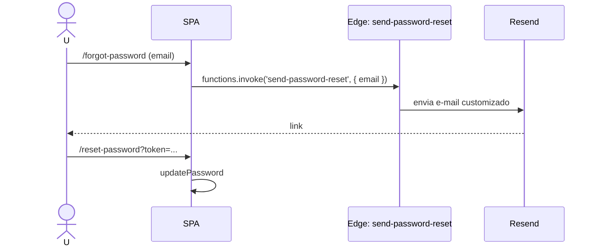
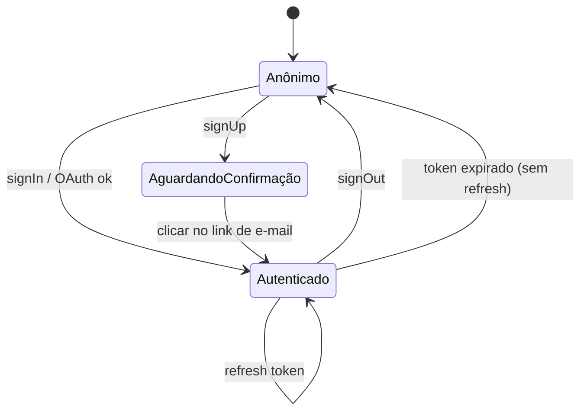

# Fluxo: Autenticação

## Cadastro (e-mail/senha)

## Login

## OAuth

## Login com 3 tentativas falhas → reset inline

Após 3 falhas consecutivas, a tela de login exibe um link "Esqueceu sua senha?" que dispara a Edge Function `send-password-reset` (não usa o `resetPasswordForEmail` nativo — ver [ADR-0008](../decisions/ADR-0008-resend-emails.md)).

## Recuperação de senha (via /forgot-password)

Mesmo fluxo, disparado a partir da página dedicada:

## Estados da sessão

## Regras envolvidas

- [RN-001 a RN-016](../business-rules/regras-de-negocio.md#3-cadastro-e-ciclo-de-vida-da-conta) — papéis, estados de conta, default `PENDING`.
- [RN-017](../business-rules/regras-de-negocio.md) — 3 tentativas falhas revelam reset de senha.
- [auth.md](../api/auth.md) — endpoints e claims.
- [edge-functions.md](../api/edge-functions.md) — `send-password-reset` detalhado.
- [triggers.md](../database/triggers.md#handle_new_user) — criação automática de `profiles`.
