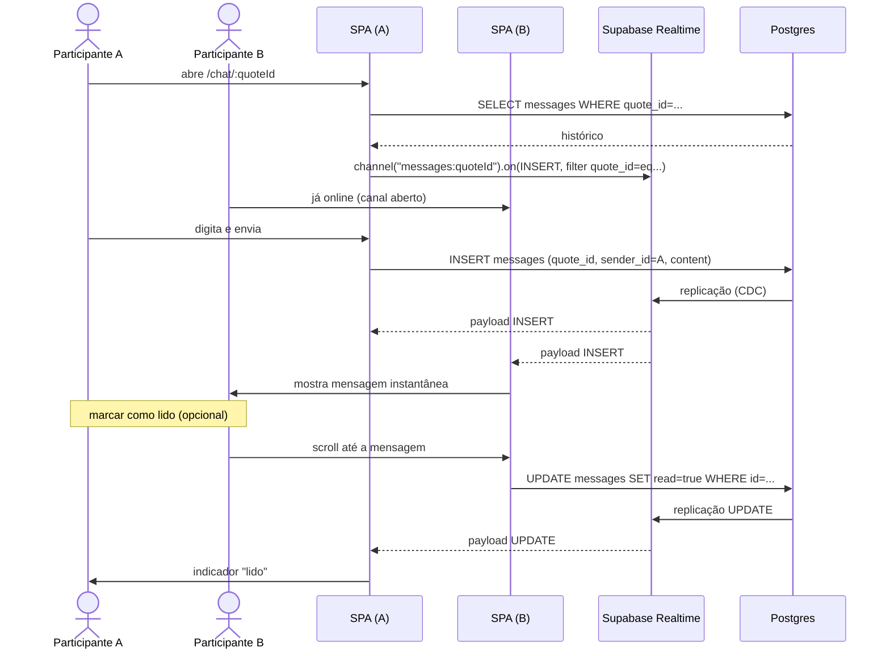

# Fluxo: Chat (Mensagens em tempo real)

Conversa atrelada a uma `quote`. Apenas participantes leem/enviam (RN-061).



## Setup do canal

Ver [api/realtime.md](../api/realtime.md). Resumo:

```ts
channel = client
  .channel(`messages:${quoteId}`)
  .on('postgres_changes',
      { event: 'INSERT', schema: 'public', table: 'messages', filter: `quote_id=eq.${quoteId}` },
      onInsert)
  .on('postgres_changes',
      { event: 'UPDATE', schema: 'public', table: 'messages', filter: `quote_id=eq.${quoteId}` },
      onUpdate)
  .subscribe();
```

**Sempre** `removeChannel` no `ngOnDestroy`.

## Edge cases

| Caso                                  | Comportamento esperado                              |
| ------------------------------------- | --------------------------------------------------- |
| Usuário não-participante tenta entrar | RLS bloqueia SELECT → tela vazia/erro 403           |
| Conexão cai                           | SDK reconecta; mostrar badge "reconectando…"        |
| Mensagem chega duplicada              | Deduplicar por `id` na lista                        |
| Quote deletada                        | `messages ON DELETE CASCADE` limpa o histórico      |
| Mensagem vazia                        | `content NOT NULL` bloqueia (RN-062)                |

## Regras envolvidas

- [RN-060 a RN-064](../business-rules/regras-de-negocio.md#8-chat-mensagens).
