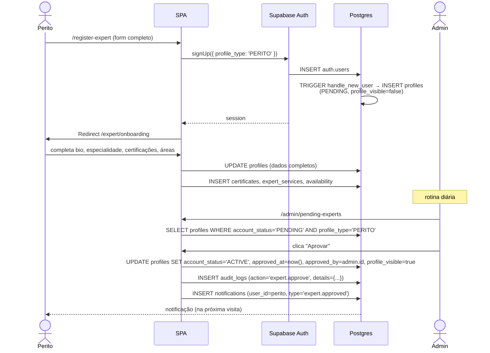
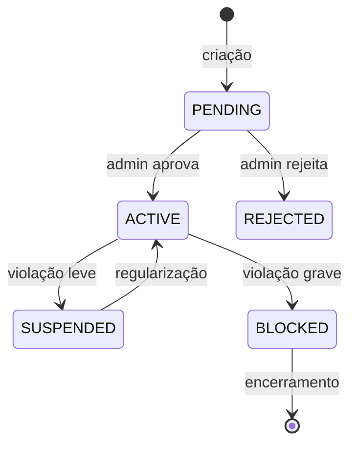

# Fluxo: Onboarding de Perito

Do cadastro até o perfil público.

## Estados do perfil de perito

## Pontos críticos

- `profile_visible` começa `false` mesmo após `ACTIVE`. O perito decide quando publicar (RN-021).
- Aprovação registra `approved_by` (RN-012) — auditável.
- Toda transição grava `audit_logs` (RN-140).
- A rejeição deve mandar e-mail/notificação explicativa (boa prática, não obrigatória no schema).

## Regras envolvidas

- [RN-011, RN-012, RN-016, RN-020 a RN-024](../business-rules/regras-de-negocio.md).
- Veja também: [admin-approval.md](admin-approval.md).
