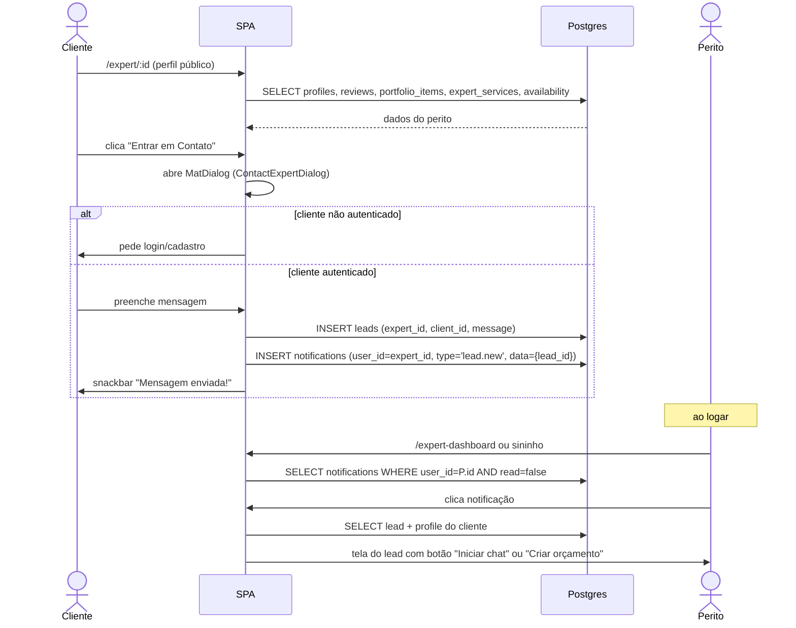

# Fluxo: Contato (Lead)

Cliente abre o perfil público e dispara um lead.

## Decisões

- O **lead exige cliente identificado** (RN-040). Visitantes anônimos veem o botão mas são redirecionados para cadastro/login.
- A mensagem é **NOT NULL** — sem lead vazio (RN-042).
- Notificação é gerada imediatamente; e-mail transacional fica como próxima iteração ([roadmap.md](../prd/roadmap.md)).

## Conexões com outros fluxos

- Lead → eventualmente vira **quote** ([quote-lifecycle.md](quote-lifecycle.md)).
- Quote vira **service_completion** → **review** ([review-flow.md](review-flow.md)).

## Regras envolvidas

- [RN-040 a RN-044](../business-rules/regras-de-negocio.md#6-contato-e-leads).
