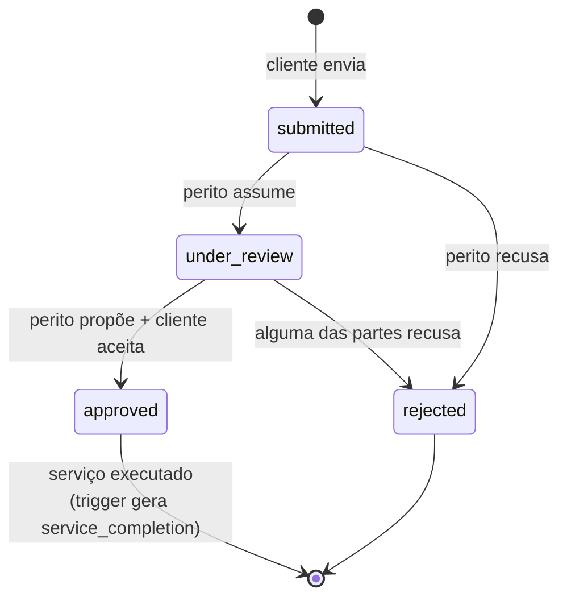
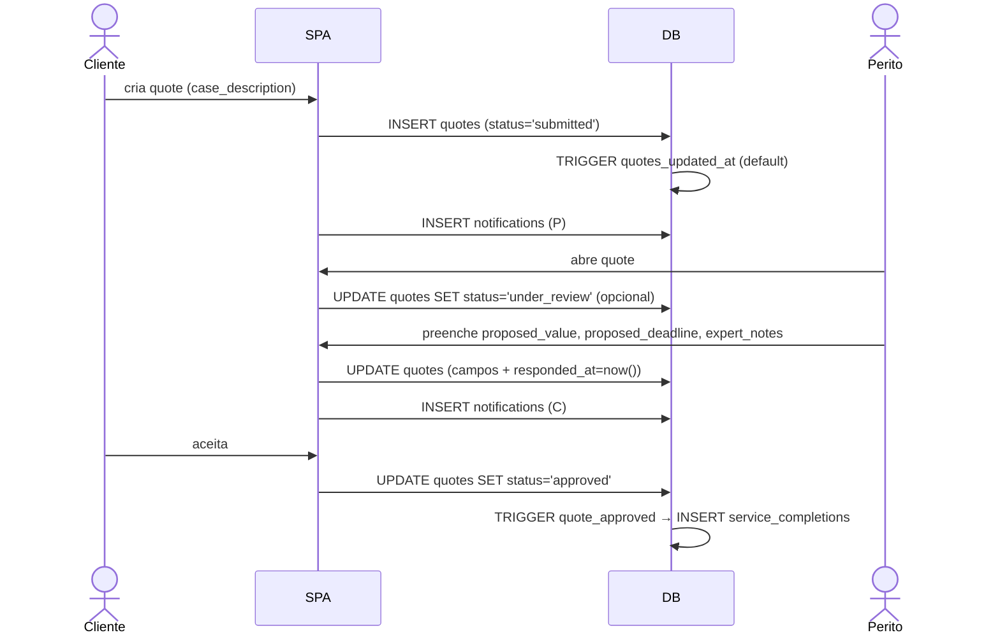

# Fluxo: Ciclo de vida do Orçamento

## Sequência típica

## Quem pode o quê

| Ação                                          | Quem                | RLS                                                  |
| --------------------------------------------- | ------------------- | ---------------------------------------------------- |
| Criar quote                                   | qualquer um (RN-051)| `Anyone can create quotes`                           |
| Ver quote                                     | requester + expert  | `Users can view their sent quotes`, `Experts can view received quotes` |
| Alterar `proposed_value`/`proposed_deadline`/`expert_notes` | perito | `Experts can update their quotes`                  |
| Alterar `status` para `approved`/`rejected` (do lado cliente) | cliente | `Requesters can update quote status` |
| Gerar `service_completions`                   | trigger             | n/a (banco)                                          |

## Notificações sugeridas

| Evento                       | Para         | Tipo                  |
| ---------------------------- | ------------ | --------------------- |
| Nova quote                   | Perito       | `quote.received`      |
| Perito respondeu             | Cliente      | `quote.responded`     |
| Quote aprovada               | Perito       | `quote.approved`      |
| Quote rejeitada              | ambos        | `quote.rejected`      |

(Implementar via [notification.service.ts](../../src/app/services/notification.service.ts).)

## Regras envolvidas

- [RN-050 a RN-056](../business-rules/regras-de-negocio.md#7-orçamentos-quotes).
- Trigger: [triggers.md](../database/triggers.md#create_service_completion).
