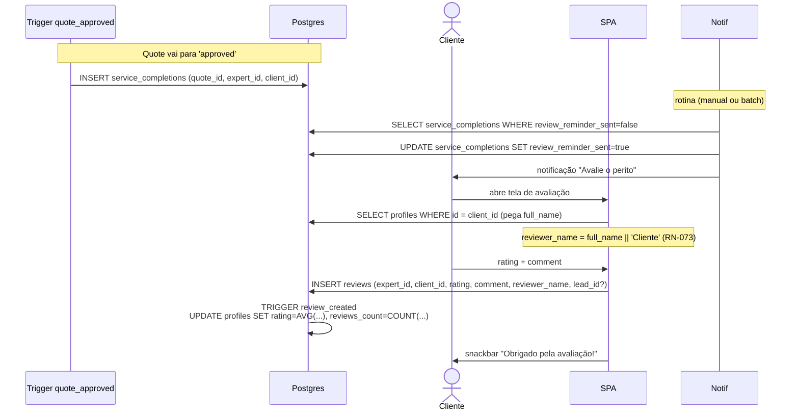

# Fluxo: Avaliação Pós-Serviço



## Regra crítica — RN-073

`reviewer_name` **sempre** vem de `profiles.full_name` do cliente. Fallback `'Cliente'` se vazio. **Nunca** confiar em campo enviado pelo cliente.

Pseudocódigo do serviço:

```ts
async createReview(input: CreateReviewInput) {
  const client = await this.profiles.getById(input.clientId);
  const reviewerName = client?.full_name?.trim() || 'Cliente';

  const { data, error } = await this.supa.client
    .from('reviews')
    .insert({
      expert_id: input.expertId,
      client_id: input.clientId,
      rating: input.rating,
      comment: input.comment ?? null,
      reviewer_name: reviewerName,
      lead_id: input.leadId ?? null,
    })
    .select()
    .single();

  if (error) throw this.supa.normalizeError(error);
  return data;
}
```

## Recalculo automático

`profiles.rating` e `profiles.reviews_count` **não** são atualizados pela aplicação — o trigger `update_expert_rating` cuida (RN-023, RN-077).

## Edge cases

| Caso                                       | Comportamento                                                  |
| ------------------------------------------ | -------------------------------------------------------------- |
| `full_name` nulo no perfil do cliente      | Usa `'Cliente'`                                                |
| Cliente avalia o mesmo perito várias vezes | Schema permite hoje. Considerar `UNIQUE(client_id, expert_id, lead_id)` em iteração futura |
| `rating` fora do range                     | `CHECK (rating BETWEEN 1 AND 5)` rejeita                       |
| Excluir review                             | Não implementado; exigiria trigger AFTER DELETE para recálculo |

## Regras envolvidas

- [RN-070 a RN-077](../business-rules/regras-de-negocio.md#9-conclusão-de-serviço-e-avaliações).
