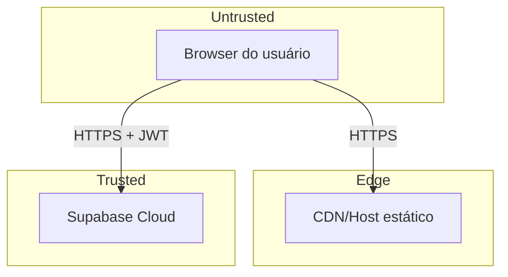

# Modelo de Ameaças — STRIDE

Análise estruturada por categoria. Para cada ameaça: descrição → vetor → mitigação.

## Fronteiras de confiança

Tudo que vem do browser é **não confiável**. O JWT só prova **identidade**, não intenção.

---

## S — Spoofing (Personificação)

| Ameaça                                       | Vetor                                      | Mitigação                                                  |
| -------------------------------------------- | ------------------------------------------ | ---------------------------------------------------------- |
| Login com credenciais roubadas               | Phishing, vazamento                        | MFA quando viável; rate limit em login (Supabase Auth)     |
| OAuth callback malicioso                     | URL redirect manipulada                    | Allowlist de `redirect_to` no painel Supabase              |
| Token de sessão em XSS                       | Injeção de JS                              | Mitigar XSS (Angular escapa por padrão); HttpOnly cookies (Supabase usa localStorage por default — aceitar trade-off, registrar em ADR) |
| Falsificação de `reviewer_name`              | Cliente envia nome arbitrário              | **RN-073**: nome vem do perfil no servidor                 |

## T — Tampering (Adulteração)

| Ameaça                                       | Vetor                                      | Mitigação                                                  |
| -------------------------------------------- | ------------------------------------------ | ---------------------------------------------------------- |
| Alterar perfil de outro usuário              | UPDATE direto via PostgREST                | RLS `auth.uid() = id`                                      |
| Forjar `is_verified`/`is_featured`           | Cliente envia o campo                      | UI não expõe; idealmente policy bloqueia (a verificar)     |
| Modificar `rating` direto                    | UPDATE em `profiles.rating`                | Trigger é a fonte; idealmente remover permissão de update desses campos via policy granular |
| Injetar HTML em campos de texto              | XSS persistente                            | Angular escapa interpolação; **nunca** usar `innerHTML` com input não sanitizado |
| Subir arquivo malicioso                      | Upload com MIME falso                      | Validar MIME e tamanho no cliente + restringir no bucket   |

## R — Repudiation (Repúdio)

| Ameaça                                       | Vetor                                      | Mitigação                                                  |
| -------------------------------------------- | ------------------------------------------ | ---------------------------------------------------------- |
| Admin nega aprovação polêmica                | "Eu não aprovei esse perito"               | `audit_logs` com `approved_by`, `created_at`, `details`    |
| Usuário nega ter enviado mensagem            | Disputa em chat                            | `messages.sender_id` autenticado; logs de Auth             |
| Alteração silenciosa de configuração         | -                                          | `audit_logs` em toda ação admin sensível                   |

## I — Information Disclosure (Vazamento)

| Ameaça                                       | Vetor                                      | Mitigação                                                  |
| -------------------------------------------- | ------------------------------------------ | ---------------------------------------------------------- |
| Vazar perfis PENDING / privados              | SELECT em `profiles`                       | RLS filtra; testes em [rls-tests.md](../tests/rls-tests.md)|
| Vazar mensagens privadas                     | SELECT em `messages`                       | RLS por participação na quote                              |
| Vazar `audit_logs`                           | Acesso indevido                            | RLS restrita a ADMIN                                       |
| Vazar CV via URL adivinhável                 | Path fácil de adivinhar no Storage         | Bucket privado + signed URL com TTL curto                  |
| Exposição de service_role no bundle          | Erro humano                                | **Apenas anon key no frontend** — code review obrigatório  |
| Logs com PII                                 | Eventos de auth com e-mail                 | Hash/truncar e-mail em logs verbosos                       |

## D — Denial of Service

| Ameaça                                       | Vetor                                      | Mitigação                                                  |
| -------------------------------------------- | ------------------------------------------ | ---------------------------------------------------------- |
| Flood de cadastros (bots)                    | `signUp` em massa                          | Rate limit Supabase Auth + (futuro) captcha                |
| Spam em `contact_submissions`                | Form público sem captcha                   | Captcha (hCaptcha/Cloudflare Turnstile) — registrar ADR    |
| Flood de leads para um perito                | UI/API                                     | Rate limit por usuário; throttle no `LeadService`          |
| Query pesada via PostgREST                   | Filtros não indexados                      | Índices ([database/indexes.md](../database/indexes.md))    |
| Realtime: muitos canais                      | Cliente abusivo                            | Limites do plano; monitorar painel                         |

## E — Elevation of Privilege

| Ameaça                                       | Vetor                                      | Mitigação                                                  |
| -------------------------------------------- | ------------------------------------------ | ---------------------------------------------------------- |
| Cliente vira admin via update no profile     | UPDATE em `profile_type`                   | RLS `update own profile` permite — risco real. Mitigar com policy granular: `profile_type` só ADMIN edita. **Ação:** validar e implementar. |
| Burlar guard via URL direta                  | Acesso a `/admin` sem ser admin            | Guards + RLS na consulta — `/admin/users` falha no SELECT  |
| Quote anônima cria carga indevida            | Insert sem `requester_id`                  | Aceitar (RN-051) mas validar limites de tamanho/qtd        |

## Ações de mitigação prioritárias

1. **Bloquear no banco** alteração de `profile_type`, `account_status`, `is_verified`, `is_featured` por não-admin. Hoje a policy `Users can update own profile` permite tudo do dono.
2. **Captcha** no formulário público de contato e cadastro.
3. **Buckets privados** para CV e documentos.
4. **CSP** restritivo (ver [csp.md](csp.md)).
5. **Auditar logs** trimestralmente.
